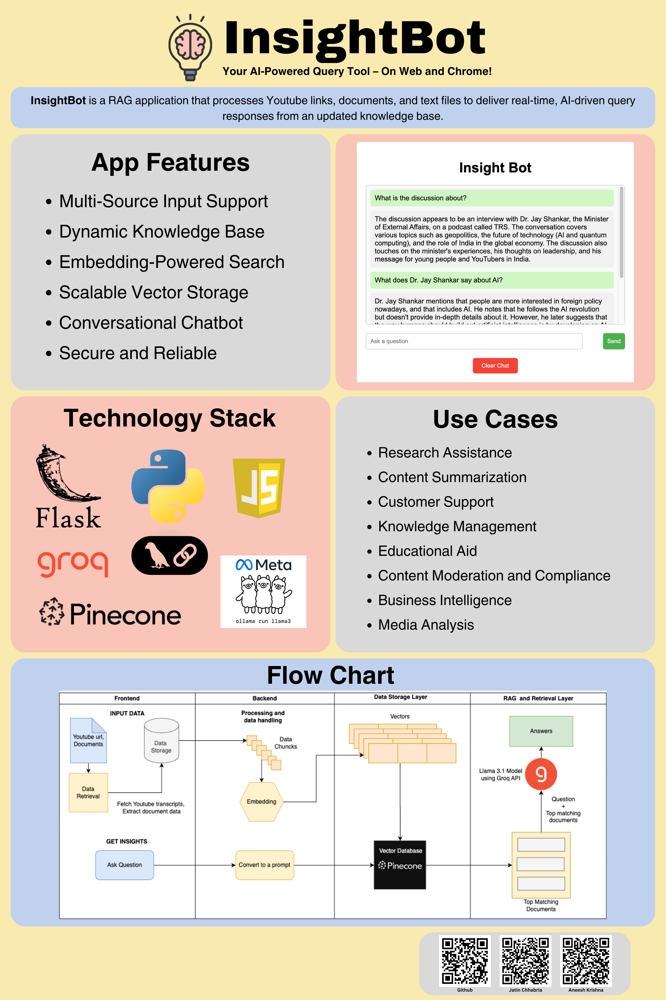

# InsightBot
Get instant, AI-driven insights with InsightBot! This web and Chrome-based tool uses a Retrieval-Augmented Generation (RAG) approach to provide real-time answers by processing YouTube links, documents, and text files. Benefit from features like multi-source input, dynamic knowledge base, and a conversational chatbot. InsightBot is built on a robust technology stack, including Flask, Groq, Pinecone, and Llama 3, making it a secure and reliable solution for various use cases, including research, content summarization, and knowledge management.

